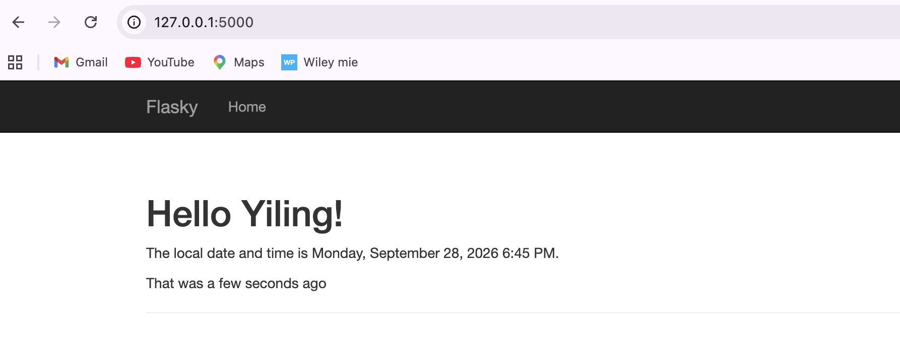
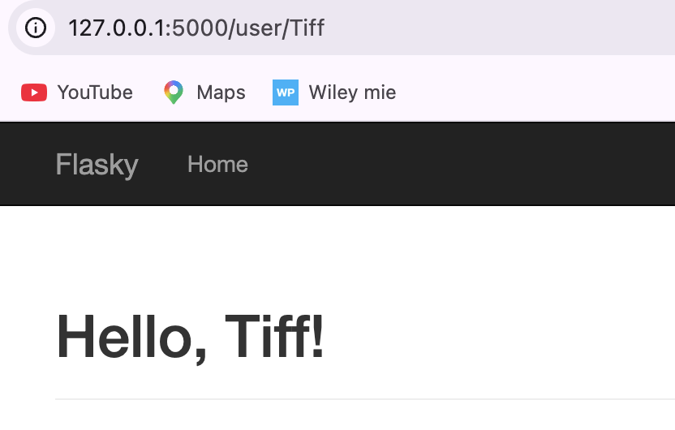
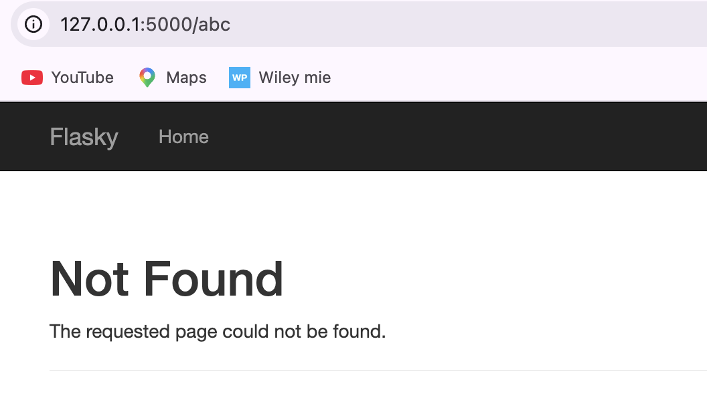

# E444-F2026-PRA3

**Name:** Yiling Zha

This repository is a clone/reproduction of the Flasky repository by Miguel Grinberg:

https://github.com/miguelgrinberg/flasky

The Flasky source code is used as the basis for reproducing the textbook examples in ECE444 PRA3.

### Example 2-1 
Op commands: 
- source venv/bin/activate
- export FLASK_APP=hello.py
- flask run

## Activity 1.3 
Screenshot of the Chapter 3 Flask application:

